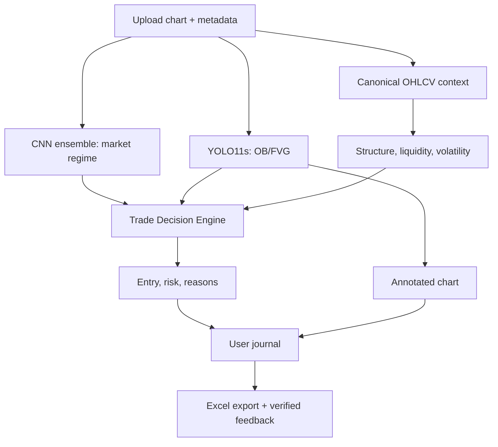

# AI-TDSS

AI Trading Decision Support System (AI-TDSS) adalah sistem pendukung keputusan trading berbasis web. Pengguna mengunggah gambar chart, sistem menggabungkan analisis visual dan data OHLCV, lalu mengembalikan rekomendasi `BUY`, `SELL`, `WATCHLIST`, atau `NO_TRADE` beserta area entry, stop loss, take profit, risk-reward, alasan analisis, dan gambar beranotasi.

AI-TDSS bukan sistem auto-trading dan tidak mengeksekusi order ke broker. Pair penelitian utama adalah **GBPUSD**. XAUUSD dipertahankan sebagai pair penelitian sekunder untuk menguji generalisasi.

## Arsitektur Inti



| Komponen | Tanggung jawab | Bukan tanggung jawab |
|---|---|---|
| CNN ensemble | Mengklasifikasikan regime `bearish`, `bullish`, atau `sideways` | Menentukan entry sendirian |
| YOLO11s | Mendeteksi dan menggambar bounding box `order_block` dan `fair_value_gap` | Mendeteksi liquidity atau membuat keputusan trade langsung |
| Aturan OHLCV | Menghitung liquidity, sweep, EQH/EQL, BOS/CHOCH, candle pattern, volatilitas, dan konteks sesi | Menghasilkan bounding box visual |
| Trade Decision Engine | Menggabungkan seluruh bukti dan menerapkan execution/risk gate | Menjamin keuntungan atau mengeksekusi order |
| Journal | Menyimpan setiap analisis, outcome, dan versi model; menyediakan ekspor Excel | Menjadikan prediksi AI sebagai ground truth otomatis |

Kontrak kanonis yang dapat divalidasi mesin berada di [`config/project_contract.json`](config/project_contract.json).

## Baseline Penelitian Saat Ini

- CNN weighted ensemble (VGG11, VGG16, GoogLeNet, ResNet18) pada test 2025: accuracy `0.8607` dan Macro F1 `0.8427`.
- YOLO11s 50 epoch untuk OB/FVG pada final test 2025: precision `0.591`, recall `0.593`, mAP50 `0.590`, dan mAP50-95 `0.452`.
- Eksperimen YOLOv8n incremental sebelumnya valid sebagai proof of workflow, tetapi masih kalah dari cumulative baseline pada final test 2025.
- Pipeline FastAPI CNN→YOLO→OHLCV→structure→risk→execution gate sudah terintegrasi.
- Halaman upload React sudah memakai `/api/analysis/full` dan menampilkan keputusan publik, parameter risiko, reason codes, ringkasan regime/detection, serta annotated chart OB/FVG.
- Runner audit lokal tersedia untuk mengukur detection, pairing, `WATCHLIST`, actionable, `NO_TRADE`, dan distribusi blocker pada seluruh test window 2025 tanpa retraining.
- Kalibrasi plot-aware lulus A/B development GBPUSD 2024 dan dibekukan untuk satu paired comparison 2025; fitur tetap opt-in dan default API belum berubah.
- Journal persisten, feedback outcome, dan ekspor Excel masih menjadi pekerjaan berikutnya.

Lihat [`docs/research/AI_TDSS_RESEARCH_SYNTHESIS.md`](docs/research/AI_TDSS_RESEARCH_SYNTHESIS.md) untuk metodologi dan batas klaim penelitian.

## Kebijakan Incremental Learning

Incremental learning berjalan sebagai proses **offline batch di laptop lokal**, bukan setiap kali pengguna mengunggah gambar dan bukan di GitHub Actions.

Data baru hanya dapat menjadi kandidat training jika outcome dapat diverifikasi dan lolos quality gate. Prediksi mentah AI tidak boleh digunakan sebagai label karena akan memperkuat kesalahan model sendiri. Candidate model dibandingkan dengan champion memakai frozen temporal holdout dan walk-forward evaluation sebelum boleh dipromosikan.

Trigger awal penelitian:

- preferred batch: 200 sampel eligible;
- minimum batch: 50 sampel eligible;
- interval maksimum: 30 hari, tetap mensyaratkan minimum batch;
- drift score: minimal 0.60, tetap mensyaratkan minimum batch.

Nilai tersebut merupakan parameter awal eksperimen, bukan angka final yang tidak dapat diubah.

## Penyimpanan Lokal

Raw OHLCV, chart PNG, checkpoint, dan artefak training berukuran besar tidak disimpan di GitHub. Root proyek lokal yang digunakan pada workstation pengembangan adalah:

```text
C:\Users\ASUS\Documents\Project\AI-TDSS
```

Setiap eksperimen wajib mencatat lima lokasi: input dataset, script/config, output run, checkpoint, serta report/metrics. Daftar lengkapnya tersedia di [`docs/experiments/LOCAL_EXPERIMENT_PLAN.md`](docs/experiments/LOCAL_EXPERIMENT_PLAN.md).

## Menjalankan Aplikasi

Backend kanonis:

```powershell
cd C:\Users\ASUS\Documents\Project\AI-TDSS\backend
.\.venv\Scripts\Activate.ps1
uvicorn app.main:app --reload
```

Frontend Next.js/React:

```powershell
cd C:\Users\ASUS\Documents\Project\AI-TDSS\frontend
Copy-Item .env.example .env.local
npm ci
npm run dev
```

Nilai bawaan `NEXT_PUBLIC_API_URL` adalah `http://127.0.0.1:8000`. Ubah `.env.local` hanya jika backend dijalankan pada host atau port lain.

Validasi kontrak dan unit test ringan:

```powershell
cd C:\Users\ASUS\Documents\Project\AI-TDSS
python ai\scripts\validate_project_contract.py
$env:PYTHONPATH = "backend"
python -m unittest discover -s backend\tests -p "test_*.py" -v
```

Smoke audit decision coverage pada 10 chart GBPUSD 2025, dengan backend tetap berjalan pada port 8000:

```powershell
python ai\scripts\audit_decision_coverage.py `
  --year 2025 `
  --pair GBPUSD `
  --sample-size 10 `
  --seed 42 `
  --confidence-threshold 0.25 `
  --output-dir ".\local_artifacts\decision_coverage\gbpusd_2025_smoke"
```

Runner menyimpan checkpoint CSV setelah setiap gambar dan dapat dilanjutkan menggunakan `--resume`. Panduan lengkap: [`docs/experiments/DECISION_COVERAGE_AUDIT.md`](docs/experiments/DECISION_COVERAGE_AUDIT.md).

Targeted E2.1 review dapat memilih exact `image_id`, menyimpan full response JSON, dan memverifikasi annotated PNG tanpa mengubah keputusan produksi. Panduan: [`docs/experiments/E2_1_DIAGNOSTIC_REVIEW_PACK.md`](docs/experiments/E2_1_DIAGNOSTIC_REVIEW_PACK.md).

E2.2 membandingkan mapping full-image dengan plot-aware pada GBPUSD 2024. Gate development telah lulus, tetapi kandidat belum menjadi default produksi. Protokol: [`docs/experiments/E2_2_PLOT_MAPPING_CALIBRATION.md`](docs/experiments/E2_2_PLOT_MAPPING_CALIBRATION.md). Bukti dan freeze: [`docs/experiments/E2_2_PLOT_MAPPING_RESULT.md`](docs/experiments/E2_2_PLOT_MAPPING_RESULT.md).

Setelah mapping dibekukan, E2.3 mengevaluasi tier `HIGH_RISK_CANDIDATE` pada populasi per trading day. Tier ini tidak boleh melewati kegagalan metadata, OHLCV, mapping, entry side, atau invalidasi zona. Panduan: [`docs/experiments/E2_3_HIGH_RISK_DAILY_COVERAGE.md`](docs/experiments/E2_3_HIGH_RISK_DAILY_COVERAGE.md).

## Dokumen Utama

- [Research synthesis](docs/research/AI_TDSS_RESEARCH_SYNTHESIS.md)
- [Local experiment plan](docs/experiments/LOCAL_EXPERIMENT_PLAN.md)
- [Decision coverage audit](docs/experiments/DECISION_COVERAGE_AUDIT.md)
- [E2.1 diagnostic review pack](docs/experiments/E2_1_DIAGNOSTIC_REVIEW_PACK.md)
- [E2.2 plot-aware mapping calibration](docs/experiments/E2_2_PLOT_MAPPING_CALIBRATION.md)
- [E2.2 result and freeze](docs/experiments/E2_2_PLOT_MAPPING_RESULT.md)
- [E2.3 high-risk daily coverage](docs/experiments/E2_3_HIGH_RISK_DAILY_COVERAGE.md)
- [System overview](docs/sdd/chapters/CH01_System_Overview.md)
- [AI architecture](docs/sdd/chapters/CH06_AI_Architecture.md)
- [Trading journal](docs/sdd/chapters/CH11_Trading_Journal.md)
- [Incremental learning](docs/sdd/chapters/CH12_Incremental_Learning.md)
- [Final CNN ensemble result](ai/classification/reports/FINAL_CNN_ENSEMBLE_RESULT.md)
- [Final YOLO model selection](ai/benchmarks/reports/FINAL_YOLO_MODEL_SELECTION.md)

## Urutan Pengembangan Berikutnya

1. Terapkan freeze E2.2, lalu jalankan tepat satu paired full-image vs plot-aware comparison pada GBPUSD 2025 dan validasi lineage kedua run.
2. Arsipkan keputusan mapping tanpa mengubah konstanta berdasarkan hasil 2025.
3. Bangun manifest harian lalu jalankan E2.3 standard vs high-risk pada 2020–2024 dengan policy mapping yang telah dipilih.
4. Simpan setiap hasil analisis, termasuk tier high risk, `WATCHLIST`, dan `NO_TRADE`, ke journal milik pengguna.
5. Implementasikan feedback outcome terverifikasi dan unduhan workbook Excel empat sheet.
6. Jalankan product acceptance, outcome baseline, ablation, dan incremental experiment sesuai evaluation gate.

Semua rekomendasi AI-TDSS bersifat bantuan analisis, bukan nasihat keuangan atau jaminan hasil trading.
