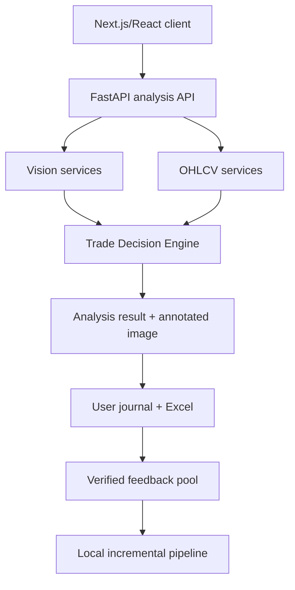

# Chapter 2 — System Architecture

## 2.1 Logical Architecture

## 2.2 Component Responsibilities

| Layer | Component | Responsibility |
|---|---|---|
| Presentation | Next.js/React | Upload, metadata form, result explanation, annotated image, journal, Excel download |
| API | FastAPI | Validation, orchestration, response contract, auth boundary |
| Vision | CNN ensemble | Market-regime probabilities dan uncertainty |
| Vision | YOLO11s | OB/FVG detections dan annotated image |
| Context | OHLCV services | Canonical candle window, structure, liquidity, volatility, session |
| Decision | Scoring/risk/execution gate | Recommendation dan entry parameters |
| Persistence | Supabase/PostgreSQL/Storage | User-scoped analysis, image, journal, outcome, model lineage |
| Learning | Local scripts | Drift report, feedback eligibility, training candidate, evaluation, promotion manifest |

## 2.3 End-to-End Flow

1. Client memvalidasi format dan ukuran gambar.
2. Client mengirim gambar, pair, timeframe, dan chart datetime.
3. API menjalankan CNN ensemble dan YOLO pada image yang sama.
4. Metadata service menyelaraskan input dengan OHLCV lokal/kanonis.
5. Structure service menghitung liquidity, BOS/CHOCH, candle context, dan volatility.
6. Price conversion memetakan kandidat zona visual ke harga.
7. Trade Decision Engine dan execution gate menghasilkan keputusan publik.
8. Rendering service menggambar OB/FVG dan entry/SL/TP bila tersedia.
9. Snapshot request, output, model versions, dan annotated image disimpan.
10. Client menampilkan hasil dan journal dapat diekspor ke Excel.

## 2.4 Failure and Degradation Rules

| Kondisi | Perilaku wajib |
|---|---|
| Gambar tidak valid | HTTP 400/415 dengan pesan jelas |
| Metadata tidak lengkap | Tidak menerbitkan entry; minta metadata atau `NO_TRADE` |
| OHLCV tidak ditemukan | Analisis visual boleh ditampilkan sebagai edukasi, tetapi entry diblokir |
| CNN gagal | Pipeline gagal terkontrol; jangan mengarang regime |
| YOLO tidak menemukan setup | `NO_TRADE`, bukan error server |
| Mapping harga low-confidence | `WATCHLIST`/`NO_TRADE` dengan blocker |
| Penyimpanan journal gagal | Hasil tidak boleh ditandai tersimpan; retry idempotent |
| Export gagal | Journal tetap aman; kembalikan error export tanpa mengubah data |

## 2.5 Deployment Boundary

Inference dapat dijalankan oleh backend aplikasi. Training dan evaluasi berat dilakukan di laptop lokal. GitHub menyimpan code/config/report kecil dan menjalankan unit test serta contract validation saja. Dataset mentah, chart hasil render, checkpoint, dan local experiment artifacts tidak disimpan di repository.

## 2.6 Canonical Backend

Entry point backend terintegrasi adalah `backend/app/main.py` dan dijalankan sebagai `uvicorn app.main:app`. File `backend/main.py` merupakan jalur foundation lama dan tidak boleh menjadi target integrasi fitur analisis baru.
