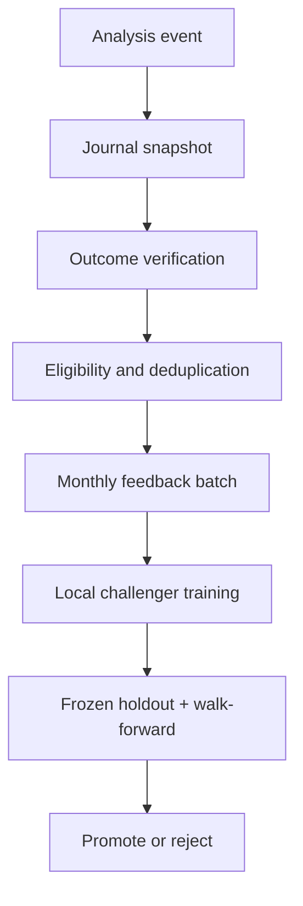

# Chapter 12 — Incremental Learning

## 12.1 Objective

Incremental learning bertujuan membantu model beradaptasi terhadap perubahan distribusi market bulanan tanpa kehilangan kemampuan pada periode historis. Proses ini merupakan offline batch model lifecycle, bukan online learning per request.

## 12.2 Scope

Prioritas update:

1. fine-tuning component CNN untuk market regime;
2. recalibration bobot ensemble;
3. evaluasi threshold/policy secara terpisah;
4. update YOLO hanya jika terdapat reviewed OB/FVG bounding boxes.

Liquidity, BOS/CHOCH, dan candle pattern tetap berupa rules/config version. Outcome trade tidak dapat menjadi label bounding box.

## 12.3 Feedback Pipeline



Raw prediction tidak boleh menjadi ground truth. Eligible sample harus memiliki label/outcome yang berasal dari data setelah event dan dapat diverifikasi.

## 12.4 Trigger Policy

Initial experimental trigger:

```text
eligible_count >= 200
OR (days_since_last_candidate >= 30 AND eligible_count >= 50)
OR (drift_score >= 0.60 AND eligible_count >= 50)
```

Trigger hanya membuat training candidate. Trigger tidak memberikan izin otomatis untuk deployment.

## 12.5 Replay and Forgetting

Naive fine-tuning pada data bulan terbaru menjadi comparator, bukan default deployment strategy. Challenger utama memakai replay sample historis yang terstratifikasi menurut regime, timeframe, dan periode. Replay manifest harus dibekukan dan disimpan bersama experiment manifest.

Forgetting diukur dengan membandingkan performa candidate dan champion pada frozen historical holdout. Cumulative retraining digunakan sebagai upper-bound comparator saat sumber daya memungkinkan.

## 12.6 Champion–Challenger Gate

Candidate hanya dapat dipromosikan jika:

- dataset dan lineage lengkap;
- frozen temporal holdout lulus;
- next-window walk-forward lulus;
- primary metric tidak mengalami regresi material;
- per-class metric dan calibration tetap layak;
- decision/trading risk metric tidak memburuk;
- artifact dapat di-rollback;
- hasil disetujui sebagai experiment decision.

Champion checkpoint tidak pernah ditimpa. Promotion mengubah deployment manifest ke version candidate yang telah lulus.

## 12.7 Execution Boundary

Training, replay construction, dan heavy evaluation dijalankan di:

```text
C:\Users\ASUS\Documents\Project\AI-TDSS
```

Artefak besar disimpan di `local_artifacts/`. GitHub Actions hanya menjalankan unit test, syntax check, dan project-contract validation.

## 12.8 Required Reports

Setiap incremental experiment menghasilkan:

- eligible feedback manifest;
- replay manifest;
- training config dan seed;
- component checkpoints;
- validation/test predictions;
- per-class metrics;
- drift and forgetting report;
- decision/trading evaluation;
- champion–challenger decision;
- experiment manifest dengan Git commit dan dataset version.

Command dan struktur folder berada di [`LOCAL_EXPERIMENT_PLAN.md`](../../experiments/LOCAL_EXPERIMENT_PLAN.md).
